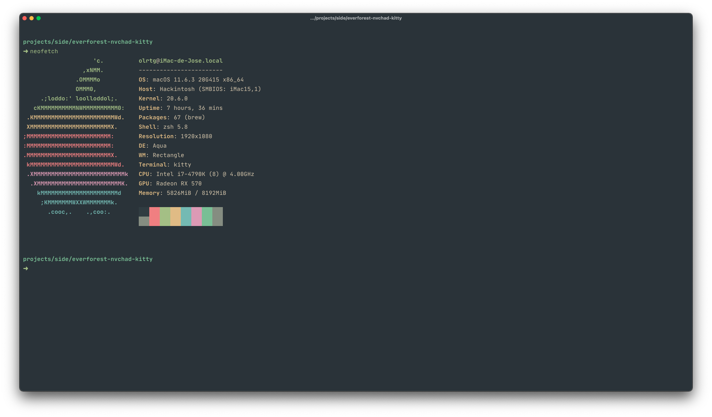

# everforest-nvchad-kitty

[](https://github.com/RichardLitt/standard-readme)

A port of [NvChad's](https://github.com/NvChad/NvChad) [Everforest theme](https://github.com/NvChad/base46/blob/master/lua/hl_themes/everforest.lua) for [kitty](https://sw.kovidgoyal.net/kitty/).



## Install

Download `everforest.conf` and place it under `~/.config/kitty/`

```conf
# ~/.config/kitty/kitty.conf

include everforest.conf
```

## License

[MIT](./LICENSE.md) © José Olórtegui
